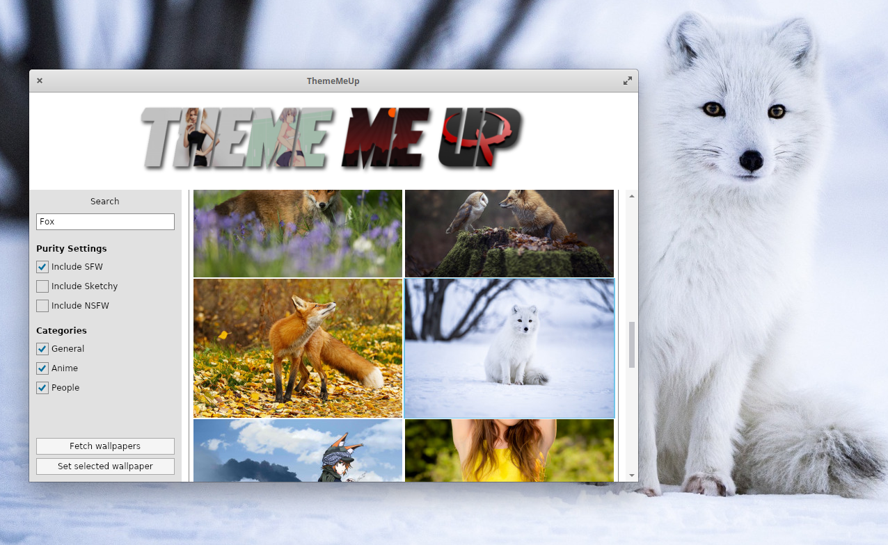

A command line + GUI utility to set wallpapers from [wallhaven.cc](https://wallhaven.cc).

⚠️ works on **GNU/Linux with GNOME** and **Windows 10**

## >> An API key is only required for NSFW wallpapers <<



## Command Line Options

### Examples

```bash
theme-me-up --nsfw --query=overwatch
```

> Sets the latest NSFW overwatch wallpaper as your desktop background

---

```bash
theme-me-up --query=id:338
```

> Sets the latest SFW wallpaper with the `night` tag. See [wallhaven.cc/tags](https://wallhaven.cc/tags) for tag IDs.

### General

| Option            | Description   |
| ----------------- |:--------------|
| `-h` or `--help`  | Displays help |
| `--api`  | Displays API key help |
| `--api-key=xxxxxxxxxxxx`  | Sets an API key |

### Sensitivity

| Option            | Description   |
| ----------------- |:--------------|
| `-n` or `--nsfw`  | Includes NSFW wallpapers. (API key required) |
| `-s` or `--sfw` | Includes safe for work wallpapers. |
| `-k` or `--sketchy` | Includes sketchy wallpapers. |

> Without any of these options, safe for work wallpaper is assumed.

### Content

| Option            | Description   |
| ----------------- |:--------------|
| `--query=[SEARCH TERM]` or `-q=[SEARCH TERM]` | Searches for a specified term. |
| `-g` or `--general` | Includes wallpapers from the "General" category. |
| `-a` or `--anime` | Includes wallpapers from the "Anime" category. |
| `-p` or `--people` | Includes wallpapers from the "People" category. |

### GNU/Linux utilities

| Option            | Description   |
| ----------------- |:--------------|
| `--gnome` | Sets the wallpaper through gsettings. (default) |
| `--feh` | Sets the wallpaper using feh. |
| `--nitrogen` | Sets the wallpaper using nitrogen. |

> _Once you use one of these options, they get stored in your config so you don't have to provide them from that point on._

## How's this project going?

~~I just needed this utility and so I put it together in a couple of minutes.~~

The code base has been updated with a proper architecture. It's still not a 100%, but it's getting better.

~~I made this tool for my own use. But who knows, I might get bored and refactor this a bunch. Or you might.~~

Some refactoring has been done, feel free to improve furhter if you're interested. I might, if I'm bored.

Things to improve:

- ~~Switch to wallhaven API~~
- Support all options wallhaven offers for filtering
    - ~~Support for content filters~~
    - Support for pages in the Avalonia UI
- Maybe allow for caching of results
- ~~Support other systems, currently made just for my Elementary OS (will probably run on Ubuntu).`~~
    - Supports Linux with Gnome, and Windows.
- ~~Add support for other wallpaper options in Linux (eg. feh or nitrogen).~~
